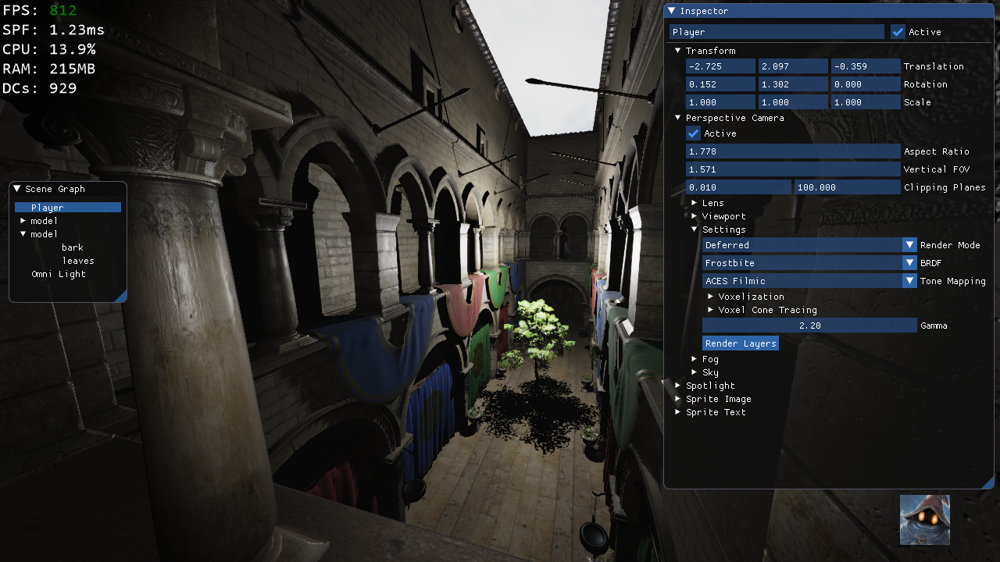

[![Build status][s1]][av] [![License][s2]][do] [![License][s3]][li] [![Join the chat at https://gitter.im/WickedEngine/Lobby][s4]][gi]

[s1]: https://ci.appveyor.com/api/projects/status/ike880pg85pupdj6?svg=true
[s2]: https://img.shields.io/badge/docs-doxygen-blue.svg
[s3]: https://img.shields.io/badge/licence-No%20Licence-blue.svg
[s4]: https://badges.gitter.im/MatthiasAdvancedGameEngine/Lobby.svg

[av]: https://ci.appveyor.com/project/matt77hias/MAGE
[do]: https://matt77hias.github.io/MAGE-Doc/MAGE-Doc/html/index.html
[gi]: https://gitter.im/MatthiasAdvancedGameEngine/Lobby?utm_source=badge&utm_medium=badge&utm_campaign=pr-badge&utm_content=badge
[li]: https://raw.githubusercontent.com/matt77hias/MAGE/master/LICENSE.txt

# [MAGE-Meta](https://matt77hias.github.io/MAGE-Meta/)

## About

The meta data of [MAGE](https://github.com/matt77hias/MAGE).

## Code
* [MAGE](https://github.com/matt77hias/MAGE)

## Documentation
* [MAGE-Doc](https://github.com/matt77hias/MAGE-Doc)

## Utilities
* [MAGE-SpriteFont](https://github.com/matt77hias/MAGE-SpriteFont)

Copyright © 2016-2017 Matthias Moulin. All Rights Reserved.

